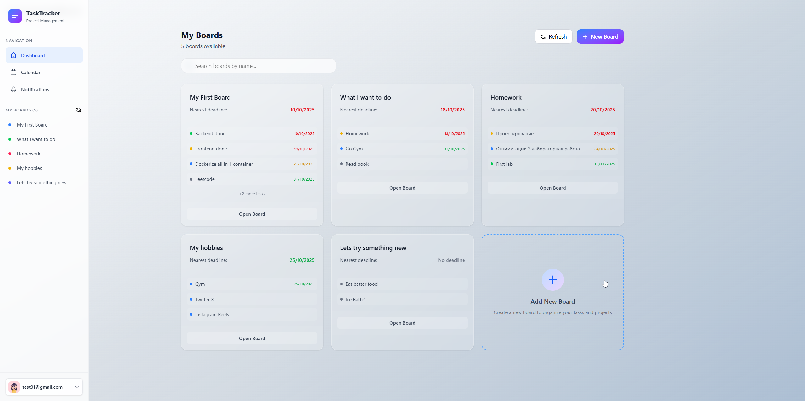
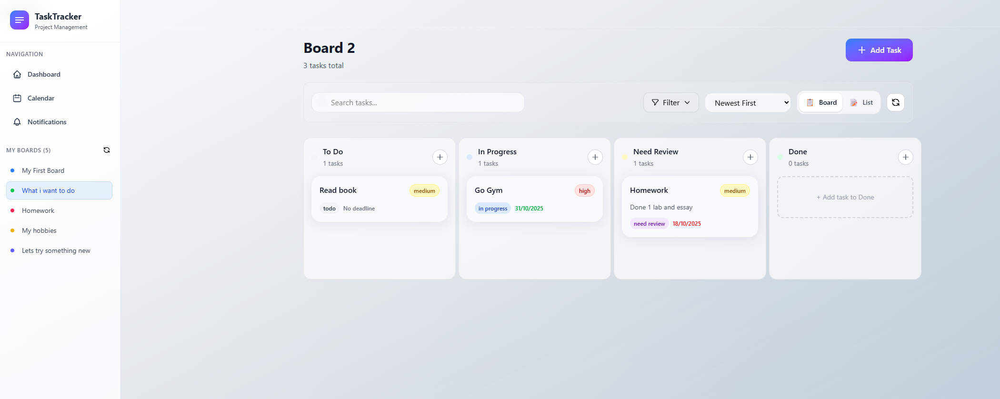
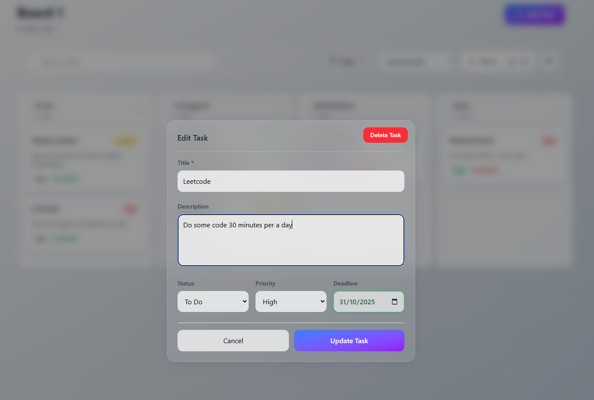
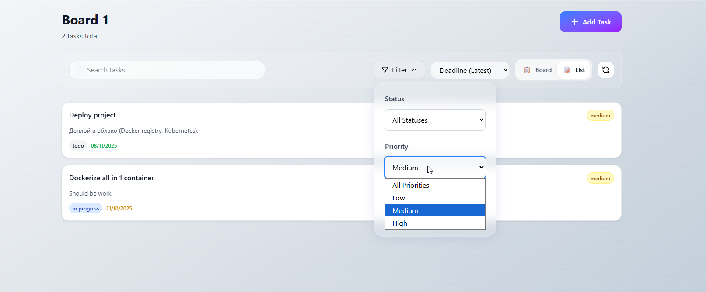
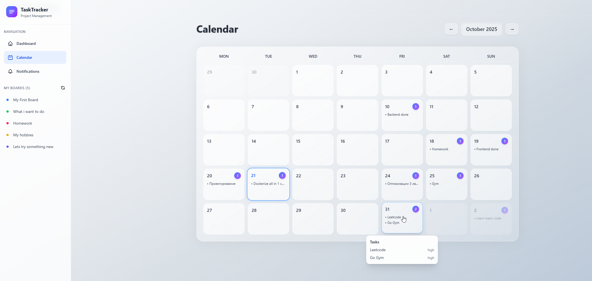

# TaskTracker

**Веб-приложение для управления задачами и расписанием**

TaskTracker — dockerized full‑stack Kanban‑style task tracker. Проект демонстрирует полный цикл разработки веб‑приложения: аутентификация и авторизация, работа с базой данных, бизнес‑логика и UI‑доска задач в стиле Kanban.

---

## Описание

TaskTracker — учебно‑практический трекер задач: создаёшь задачи на доске, перетаскиваешь между колонками (Kanban), редактируешь и отслеживаешь прогресс. Цель проекта — показать рабочую связку: Go (backend) + TypeScript (frontend) + PostgreSQL + Redis + Docker, а также реализовать надёжную аутентификацию/авторизацию и CRUD для пользовательских данных.

### Что сделано

- Полноценный backend на Go с REST API для регистрации, входа, работы с досками и задачами.
- Frontend на TypeScript (React) с Kanban‑доской.
- Хранение данных в PostgreSQL, миграции для таблиц users, boards, tasks.
- SQLC для генерации типобезопасного кода работы с базой.
- Аутентификация через JWT: access‑токен для быстрого доступа, refresh‑токен — в Redis для безопасной ротации и возможности отзывать сессии.
- Middleware для защиты маршрутов: извлекает userID из access‑токена и подставляет в контекст запроса, что гарантирует работу только с данными конкретного пользователя.
- Docker и docker-compose.yml для локальной dev‑среды (backend, frontend, db, redis и т.д.).

---

## Технологии и стек

- **Backend**: Go
- **Frontend**: TypeScript (React)
- **Database**: PostgreSQL
- **Cache**: Redis (для хранения refresh‑токенов)
- **SQL** codegen: sqlc
- **Контейнеризация**: Docker, Docker Compose
- **Авторизация**: JWT (access + refresh)

---

## Установка и запуск

### 1. Клонирование проекта

```bash
git clone https://github.com/sqszy/TaskTracker.git
cd TaskTracker
```

### 2. Настроить .env

Создайте файл .env в корне проекта как на примере .env.example

### 3. Сборка и запуск стека через Docker Compose

```
docker-compose up --build
```

### 4. После запуска:

Backend доступен на http://localhost:8080

Frontend доступен на http://localhost:5173

---

## Пример

### Главная панель (Dashboard)

  
_Главная панель с доступом к доскам и задачам после входа в систему._

---

### Kanban-доска

  
_Управление задачами по статусам — визуальный контроль прогресса._

---

### Карточка задачи

  
_Подробный просмотр задачи с описанием, сроком и приоритетом._

---

### Поиск и фильтрация

  
_Фильтрация по статусу, приоритету и дате._

  
_Поиск задач по названию, описанию._

---

### Календарь задач

  
_Календарь с задачами по дедлайну._
